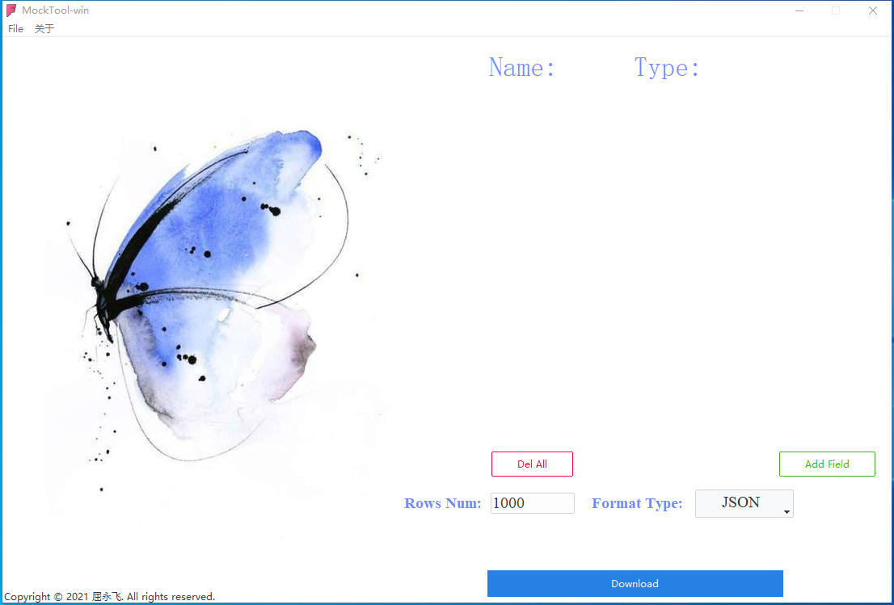
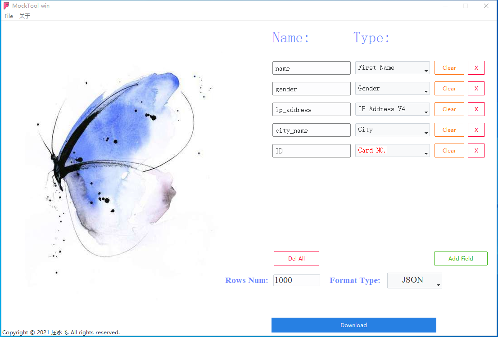
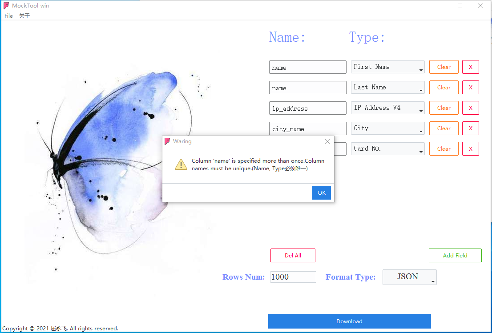

# Mock_Data_Generation
tkinter + faker 开发的一款测试数据生成工具，目前支持json，SQL等文件导出，后续会支持更多文件类型如CSV，xml，excel等。

#使用说明
Mac:直接拉去代码带本地，打开项目后回看见Mockdoo.app的图标，理论上直接双击即可运行，「Mac Big Sur 11.1 本机自测OK」
Win: 双击 win10_exe目录下的MockdooV1.exe即可 如果想运行win代码单独当成一个项目即可

#更新说明

1-新增数据语言选择；

2-新增动态添加/删除字段

3-新增一键删除所有字段

win效果如下图:
 

Mac效果如下图：

<<<<<<< HEAD

=======

>>>>>>> 85639bd2aedaec6c9434dab3b70773027f3039d6

#以知BUG和问题

1-默认导出数据语言为中文，每次打开界面，菜单不勾选，但不影响使用

1-删除字段的时候会有类似瞬间拖影但不影响使用

3-偶尔下载成功过后弹出下载成功提示窗口，点击关闭，最小化窗口后，再次打开会出现上次的下载提示成功窗口
其他未知暂未发现

2021-02-04[优化]启动速度
2022-09-08[优化]新增win版本
2022-09-08[优化]新增到处csv
2022-09-08[优化]增加导出数据量
2022-09-08[优化]新增个人联系方式

