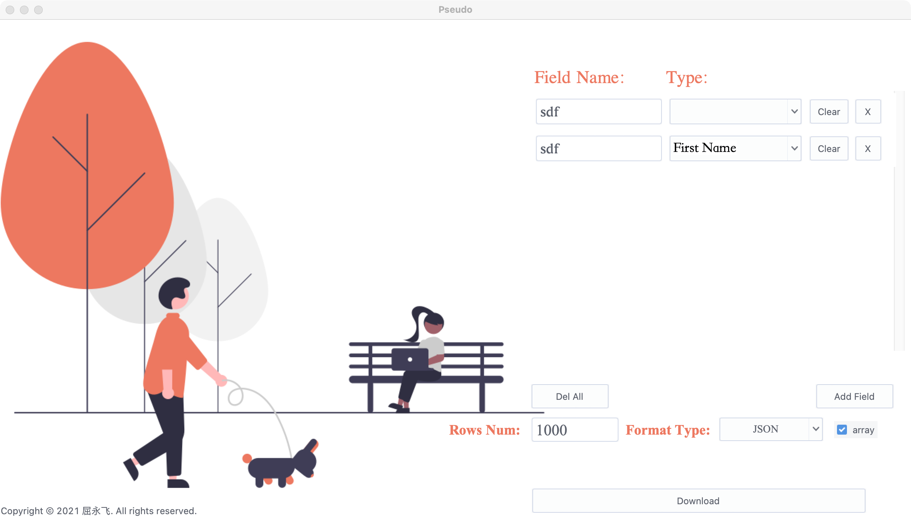
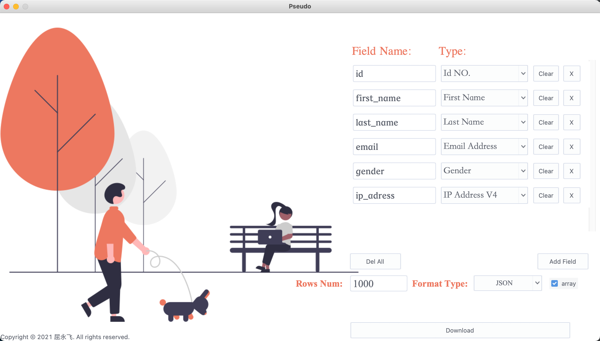
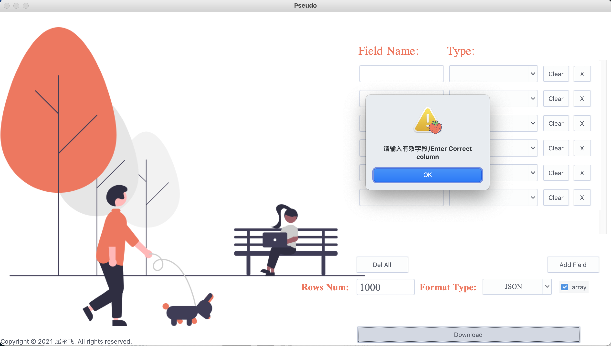

# Mock_Data_Generation
tkinter + faker 开发的一款测试数据生成工具，目前支持json，SQL等文件导出，后续会支持更多文件类型如CSV，xml，excel等。

<body>

</body>

 

 

 

#使用说明
直接拉去代码带本地，打开项目后回看见Mockdoo.app的图标，理论上直接双击即可运行，「Mac Big Sur 11.1 本机自测OK」

#更新说明
1-新增数据语言选择；
2-新增动态添加/删除字段
3-新增一键删除所有字段

效果如下图：

#以知BUG和问题
1-默认导出数据语言为中文，每次打开界面，菜单不勾选，但不影响使用
2-删除字段的时候会有类似瞬间拖影但不影响使用
3-偶尔下载成功过后弹出下载成功提示窗口，点击关闭，最小化窗口后，再次打开会出现上次的下载提示成功窗口
其他未知暂未发现